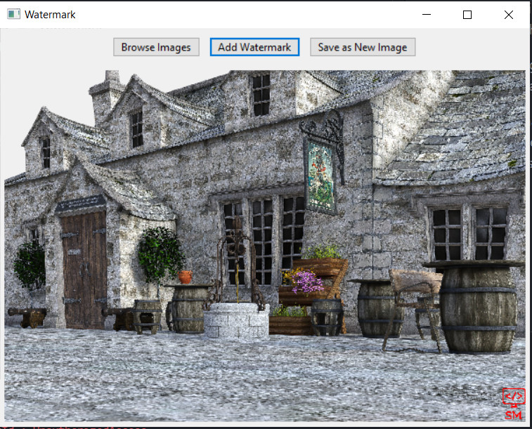

# Watermarking GUI App

---

A watermarking app with a GUI. Made with Python 3.8, wxPython for the GUI & Pillow (Python Imaging Library).

Watermarking app can use PNG images (with transparency) to watermark jpeg & png (at least with transparent backgrounds) images.

The image that will be used to watermark other images needs to be speciied (with filename & directory location) in the relavent PIL Image.open() function (line 113 - inside the add_watermark() method).

